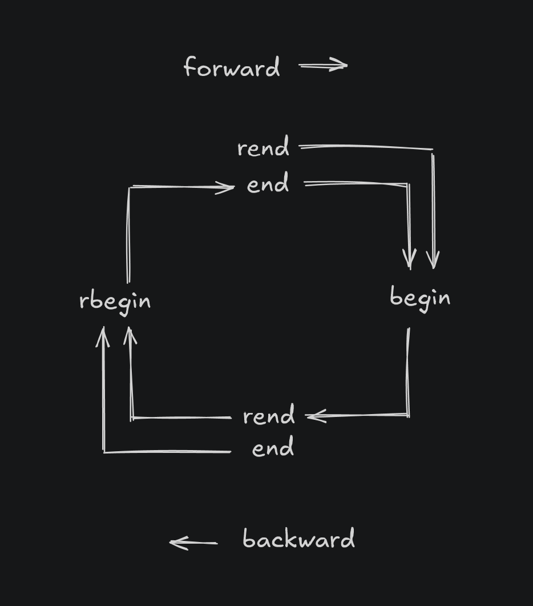

# ss

C++20 / 23 hobby project.

Mono-repo: *No submodules*

I've used these algorithms for sundry projects over time. I've re-written them here to the C++23 standard,
and with full generality of scope.

This repo includes a collection of generative algorithms for operations on subsets of $\mathcal{P}(X)$,
the power set of a set $X$. These include subset iteration, summation, and multi-selection. I may add others later.

The underlying set is an abstraction, modeled as $X = \left\\{0,\\; ...,\\; N-1\right\\}$.
In practice, $X$ itself is usually an external index into some other data structure, so there is no loss
of generality here.

Power sets are inherently extremely large (in the sense that they grow very quickly), so some discussion of
execution speed and memory consumption is also included. (Commentary for these topics in this document is
in progress.)

## Status

(_7:57 PM Friday, October 24, 2025_)

Work in progress. I have working versions of each implementation described below, but I'm in progress with updating the newer,
faster ones for multiindices, and also with completing the general case of subset summation. Until then, they won't be included in this repo.

* Fixed-size subset iteration: Random-access iteration is pending. Otherwise complete.
* Multi-set iteration: offset-based impl is complete (not included in this repo yet), bit-packed implementation is in progress
* Subset summation: working for positive sets, in progress for the general case. Needs minor unit test improvements for the positive-set case.


## Unit tests

From the repo root, this

```sh
$ g++ --std=c++23 test/main.cpp
```
compiles and links all unit tests. Verification requires only a small number of tests for this repo.

Unit tests cover fixed-size iteration, multiindex iteration, and subset summations.

## Fixed-size subset iteration


This enumerates every subset of $X$ of some chosen size $K$, $0 \le K \le N = \vert{X\vert}$.
There are $\binom{N}{K}$ many such subsets. $N > 0$ is arbitrary, subject to storage constraints.

Iteration is over every integer < $2^N$ with exactly $K$ many one bits in its binary representation,
in numerically increasing order. With the LSB == rightmost bit, the resulting bit sequences are also
lexicographically ordered.

If the chain graph of $\mathcal{P}(X)$ is traversed with a breadth-first search starting from either $\emptyset$
or from $X$, this traversal iterates the sets at a given BFS level.

For $n = \lvert X \rvert = 6$ and $k = 3$, the full bitwise subset iteration looks like this (zeroes omitted):

|   | 0 | 1 | 2 | 3 | 4 | 5 |
|:-:|:-:|:-:|:-:|:-:|:-:|:-:|
| 0 | 1 | 1 | 1 |   |   |   |
| 1 | 1 | 1 |   | 1 |   |   |
| 2 | 1 |   | 1 | 1 |   |   |
| 3 |   | 1 | 1 | 1 |   |   |
| 4 | 1 | 1 |   |   | 1 |   |
| 5 | 1 |   | 1 |   | 1 |   |
| 6 |   | 1 | 1 |   | 1 |   |
| 7 | 1 |   |   | 1 | 1 |   |
| 8 |   | 1 |   | 1 | 1 |   |
| 9 |   |   | 1 | 1 | 1 |   |
|10 | 1 | 1 |   |   |   | 1 |
|11 | 1 |   | 1 |   |   | 1 |
|12 |   | 1 | 1 |   |   | 1 |
|13 | 1 |   |   | 1 |   | 1 |
|14 |   | 1 |   | 1 |   | 1 |
|15 |   |   | 1 | 1 |   | 1 |
|16 | 1 |   |   |   | 1 | 1 |
|17 |   | 1 |   |   | 1 | 1 |
|18 |   |   | 1 |   | 1 | 1 |
|19 |   |   |   | 1 | 1 | 1 |


### Example usage

The above sequence of 20 subsets is produced by the following program. (N.B. op<< serializes MSB to LSB, so the
output is the left-to-right reverse of the above table.)

```c++
/*
  Compiled with

    g++ --std=c++23 -I. examples/00/example.cpp

  from the ss repo root.
 */

#include "subsets/fixed_size.h"
#include <iostream>

int main()
{
  int count{};

  using namespace ss::fixed_size;

  // Write to stdout every 3-subset of a 6-set.
  for(subset<6> subset{begin, 3}; subset != end; ++subset)
  {
    std::cout << count << " " << subset << std::endl;
    ++count;
  }

  return 0;
}
```

This code is in [examples/fixed-size-all-subsets/example.cpp](examples/fixed-size-all-subsets/example.cpp)

The following program code prints the first 10 subsets of $(N, K) = (89, 65)$ to stdout.

```c++
/*
  Compiled with

    g++ --std=c++23 -I. examples/00/example.cpp

  from the ss repo root.
 */

#include "subsets/fixed_size.h"
#include <iostream>

int main()
{
  int count{};

  // Select subsets of size 65 from a set of 89 points.
  for(ss::fixed_size::subset<89> subset{ss::fixed_size::begin, 65}; subset != ss::fixed_size::end; ++subset)
  {
    std::cout << subset << std::endl;

    if(++count == 10)
      break;
  }

  return 0;
}

```

This code is in [examples/00/example.cpp](examples/00/example.cpp)


### Bidirectional iteration

Bidirectional iteration is supported.

For the `ss::subset` type, it is circular. `end` are `rend` are distinct states, with distinct implementations.
They are non-terminal, and a `subset` in either state is valid for "read" purposes. I.e., `end` and `rend` are not
so-called sentinels.

Sentinal singletons are provided, as `ss::end`, `ss::begin`, etc, to support optimized comparisons such as `susbet == end`.

The state transitions among `rend`, `begin`, `rbegin`, and `end` are very simple, and follow a natural pattern.



So for forward iteration: `rbegin --> end --> begin` and `rend --> begin`.

For backward iteration: `rbegin <-- rend <-- begin` and `rbegin <-- end`.

The intent is that `end` (`rend`) is entered only by forward (backward) iteration.


### Random Access Iteration

Random access support is pending.


### Performance tests

In progress.

These tests compare different implementations for each of the
subset types in this repo. That are completed for fixed-size subsets. When I have time, I'll finish perf tests
for multi-sets and upload the results.

On my host, the following tables are a brief sample of results for fixed-size subsets described below.
* After the N and K columns, the next column in each table is the fastest absolute (`(abs)`) execution time
for forward or backward iteration.
* The columns thereafter are exec times relative to those two columns.

Note: Times in the `(abs)` column are for static allocation with *on-frame access only*.
Accessing a subset off-frame incurs a penalty of ~4ns on my host system.

Source impls compared here:
* `ss::index`: a `std::vector<std::uint64_t>`, sparse offset index into the underlying set.
This is the previous impl I used for these utilites.
* `ss::bits`: a `std::array<std::uint64_t>`, bit-packed and dense. This is the new impl.

Data collected over a minimum of 10,000,000 iterations for each
value.

Table units are `[ns / subset]`.

Forward iteration:

|  N   |  K  |ss::bits (abs) |  ss::index (rel)  |std::bitset (rel)  |
|:----:|:---:|--------------:|------------------:|------------------:|
|  502 | 200 |     0.3350    |        93.4468    |      1325.8696    |
|  848 | 318 |     0.3344    |       165.9450    |      2210.8060    |
|  999 | 233 |     0.3339    |       120.3990    |      2400.7920    |
|  999 | 712 |     0.3344    |       424.5800    |      3241.7576    |
| 1114 | 884 |     0.3372    |       532.3165    |      3731.2569    |
| 8850 |4117 |     0.3350    |      2570.9802    |     25396.9750    |

Backward iteration:

|  N   |  K  |ss::bits (abs) |  ss::index (rel)  |std::bitset (rel)  |
|:----:|:---:|--------------:|------------------:|------------------:|
|  502 | 200 |     0.3350    |        93.4305    |      1474.8884    |
|  848 | 318 |     0.3352    |       165.5847    |      2611.1661    |
|  999 | 233 |     0.3348    |       120.0779    |      3370.2465    |
|  999 | 712 |     0.3350    |       423.8702    |      2479.6406    |
| 1114 | 884 |     0.3401    |       527.7299    |      2599.5476    |
| 8850 |4117 |     0.3386    |      2543.8706    |     26419.8678    |

Notes:

1. `std::bitset` is slow. `ss::index` is ~10.4 x faster than `std::bitset`, even though `ss::index`
dynamically allocates, where `std::bitset` does not.

2. `ss::bits` execution period is essentially constant up to an array length
of 139 (implied max $N$ = 8895). This is due to iterating `ss::bits` on-frame.

3. `ss::bits` execution period is ~336 picoseconds / subset, with std dev = ~10 ps / subset / row (average).
These exec times are only on my host, so obviously reproducible on another host, but
should give an estimate of what to expect.


## Fixed-length multi-set iteration

Updated impl is in progress.

For a given a set $X$, a (dense) multiindex is just an ordered sequence of counts $\left\\{m_0, ..., m_{N-1}\right\\}$,
where each $m_i \ge 0$ is the number of occurrences of the $i^{th}$ point in $X$.

Generating all multiindices of a fixed length $L = \sum m_i$ is done in a natural order.
There are $\binom{N + L - 1}{L}$ many such multiindices.

E.g., with N = 4 and L = 3, the entire sequence is this (zeroes omitted):

|   | 0 | 1 | 2 | 3 |
|:-:|:-:|:-:|:-:|:-:|
| 0 | 3 |   |   |   |
| 1 | 2 | 1 |   |   |
| 2 | 1 | 2 |   |   |
| 3 |   | 3 |   |   |
| 4 | 2 |   | 1 |   |
| 5 | 1 | 1 | 1 |   |
| 6 |   | 2 | 1 |   |
| 7 | 1 |   | 2 |   |
| 8 |   | 1 | 2 |   |
| 9 |   |   | 3 |   |
|10 | 2 |   |   | 1 |
|11 | 1 | 1 |   | 1 |
|12 |   | 2 |   | 1 |
|13 | 1 |   | 1 | 1 |
|14 |   | 1 | 1 | 1 |
|15 |   |   | 2 | 1 |
|16 | 1 |   |   | 2 |
|17 |   | 1 |   | 2 |
|18 |   |   | 1 | 2 |
|19 |   |   |   | 3 |


The current implementation is a dense `std::array` of counts, literally as described here.

A replacement impl is pending, using bit-packed multiindex components, to reduce cache reloads.
This will be performance tested with the `std::array` of counts. When that is complete, both impls
and results for them will added to this repo.


### Bidirectional iteration

Bidirectional iteration is pending.

### Random access

Random access is supported. Documentation pending.


